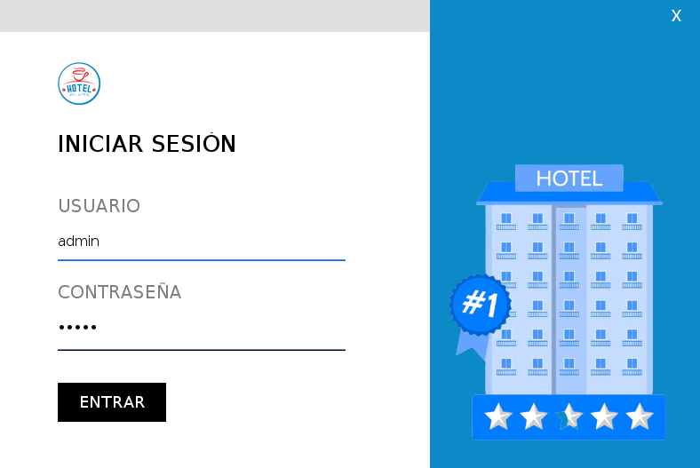
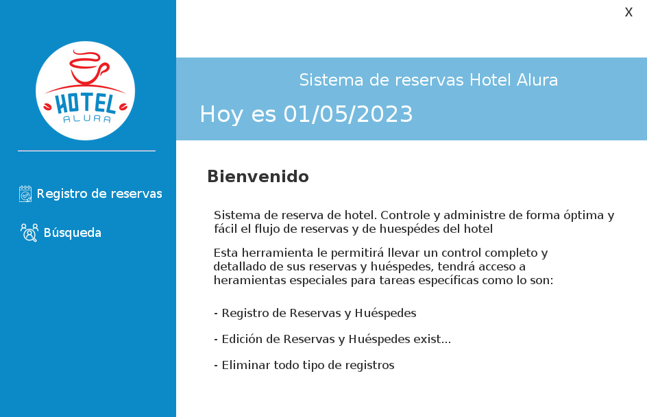
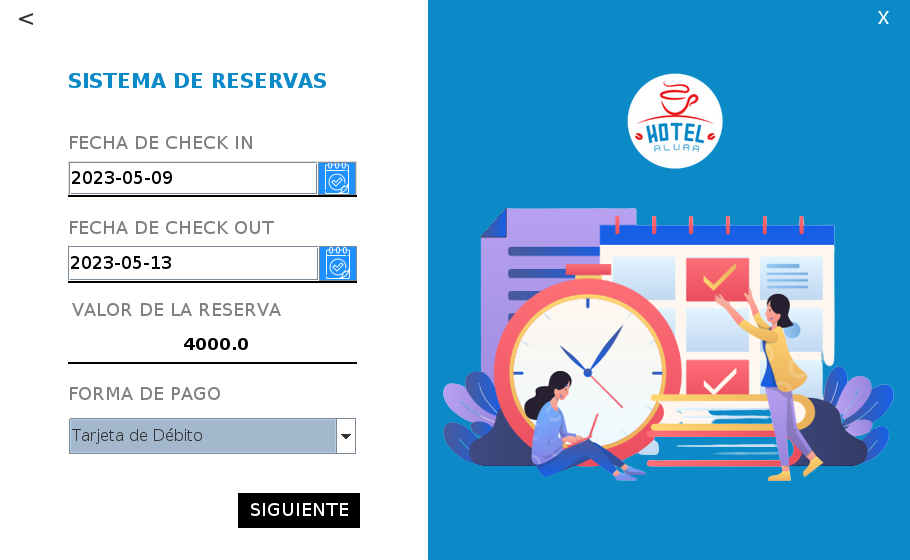
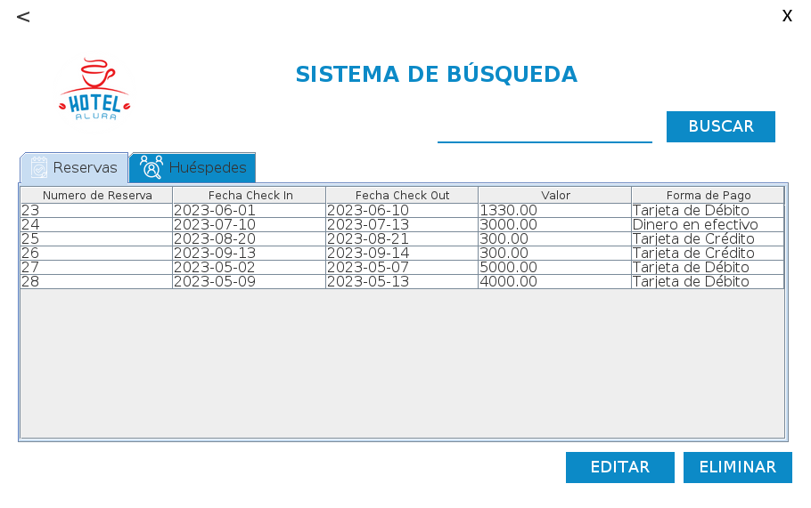
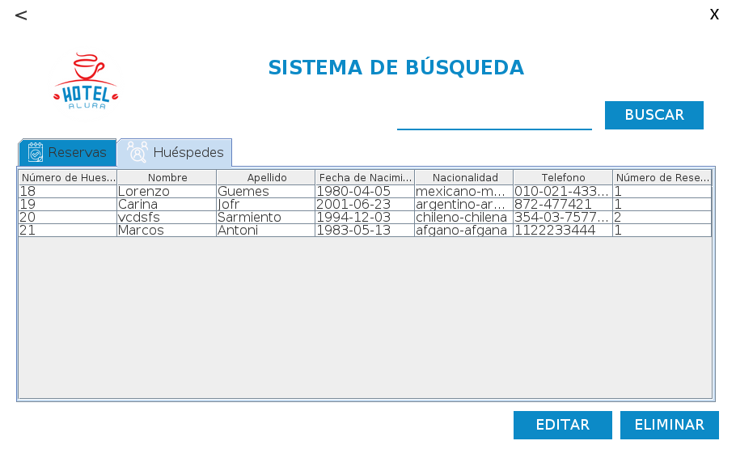
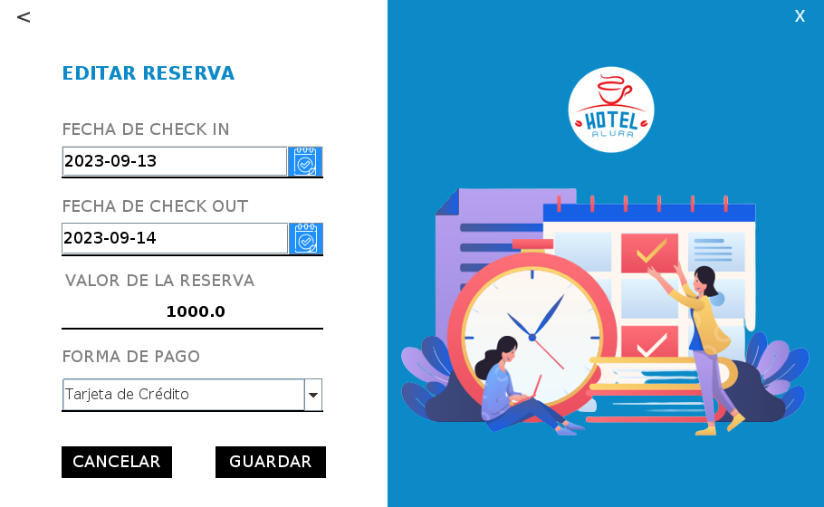
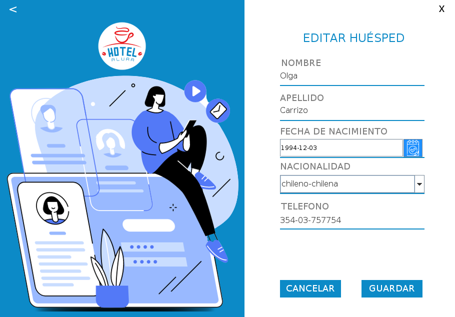

# Challenge ONE | Java | Back-end | Hotel Alura
---

### Este proyecto es un sistema básico de gestión de reservas para un hotel. 

El usuario es "admin" y la contraseña es "admin"

---
## Tecnologías Utilizadas:

- Java SE
- Eclipse
- Swing
- Biblioteca JCalendar
- Maven
- MySql
- Hibernate
- Plugin WindowBuilder

## Estructura de directorios:
- src/main/java: Carpeta base donde se guarda el código del proyecto.
- src/test/java: Carpeta donde se guardan las pruebas (o tests) del proyecto.
- src/imagenes:  Las imágenes para este documento.
- src/main/resources: Se guardan recursos como los iconos.

## Los paquetes en /src/main/java
- com.alura.hotel.views:  Agrupa las interfaces gráfica hechas con WindowBuilder.
- com.alura.hotel.controller: Agrupa controladores.
- com.alura.hotel.models: Agrupa los modelos de datos.
- com.alura.hotel.dao:  Agrupa las operaciones de acceso a base de datos.
- com.alura.hote.utils: Agrupa utilitarios.

## Los paquetes en /src/tests/java:
- com.alura.hotel.tests: Único paquete para las pruebas.

---
## Video
- https://youtu.be/jvI2cJ84qhE

---

## Diseño de la base de datos

---

##  Menu Principal

---

## Login
El usuario es "admin" y la contraseña es "admin"

---

## Menú Usuario

---

## Registrar Reserva

---

## Registro Huésped

---

## Búsqueda Reserva

---

## Búsqueda Huésped

---

## Editar Reservas

---

## Editar Huésped

